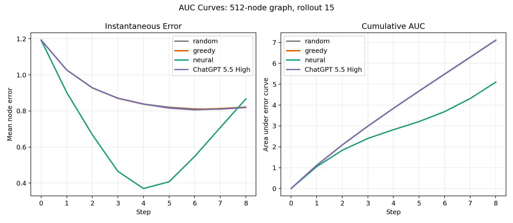
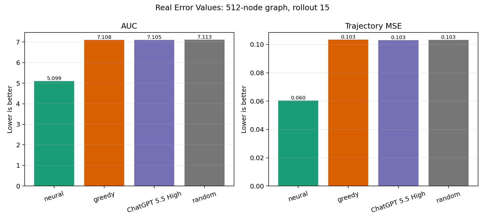
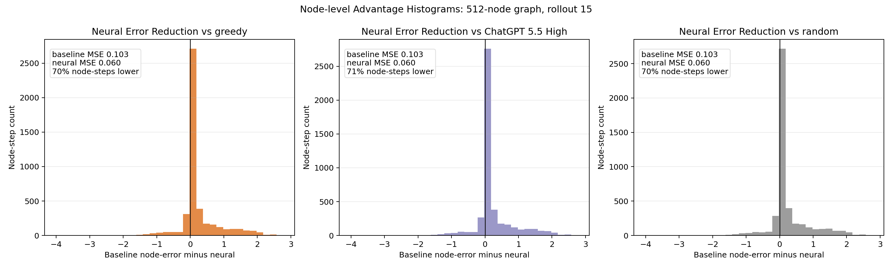
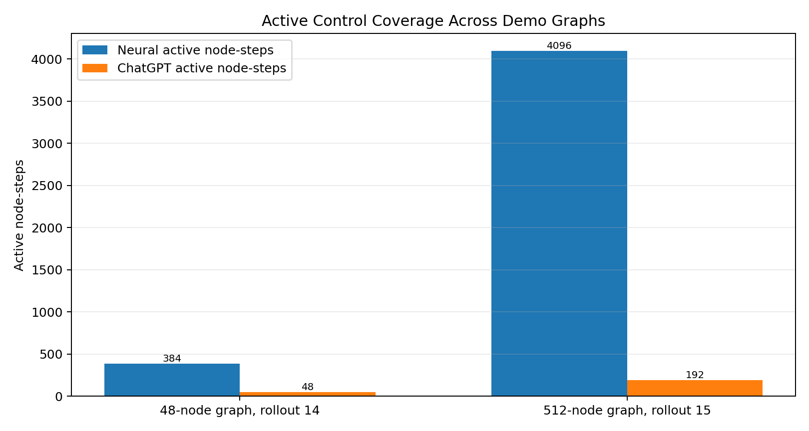
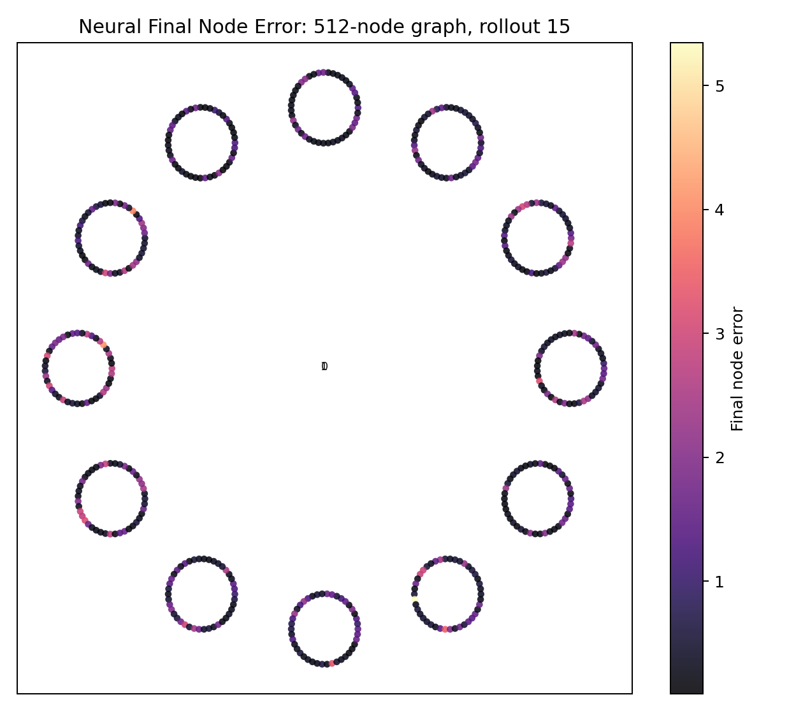

# Results and Pitch Figures

This page lists the figures that are most useful for a short pitch or demo. The goal is to avoid overwhelming the audience with training internals and focus on three claims:

1. Neural control reduces trajectory error.
2. Neural control changes graph dynamics at scale.
3. Neural control acts broadly and efficiently across the graph.

## Necessary Images

### 1. Main Dynamics Result



Use:

```text
figs/512_node_graph_rollout_015_auc_curves.png
```

Message: neural separates from random, greedy, and ChatGPT over the rollout.

### 2. Real Error Values



Use:

```text
figs/512_node_graph_rollout_015_real_error_values.png
```

Message: neural has lower AUC and trajectory MSE on the 512-node demo case.

Alternative if you want only the cleanest two-policy comparison:

```text
figs/neural_vs_greedy_real_error_values.png
```

### 3. Broad Node-level Improvement



Use:

```text
figs/512_node_graph_rollout_015_node_advantage_histograms.png
```

Message: the neural win is broad across node-time states, not just one lucky aggregate.

### 4. Control Coverage / Efficiency



Use:

```text
figs/selected_runs_control_coverage_values.png
```

Message: neural acts across the graph, while weak baselines are sparse or near no-op.

For a 512-node-only version:

```text
figs/512_node_graph_rollout_015_token_control_efficiency.png
```

### 5. Graph Visual Anchor



Use:

```text
figs/512_node_graph_rollout_015_layout_error.png
```

Message: this is graph-manifold recovery/control, not just scalar forecasting.

## Optional Images

### 48-node Proof-of-concept

Use if the pitch includes a small graph or future UI story:

```text
figs/48_node_graph_rollout_014_auc_curves.png
figs/48_node_graph_rollout_014_real_error_values.png
figs/48_node_graph_rollout_014_layout_error.png
```

### ChatGPT Timing

Use only if discussing direct LLM control as a baseline:

```text
figs/chatgpt_wallclock.png
```

## Images to Avoid in Slides

These are useful for debugging but usually too internal for a pitch:

- `training_losses.png`
- `training_source_metrics.png`
- `training_control_metrics.png`
- `artifact_storage_sizes.png`
- `closed_loop_auc_mse_tradeoff.png`
- `closed-loop-eval-*_top_run_improvements.png`

## Interpreting the 512-node Rollout

Random, greedy, and ChatGPT are not making identical decisions, but their resulting trajectories are nearly identical because their controls are too weak or too localized to change the system dynamics meaningfully.

For rollout 15:

| Policy | Active node-steps | Mean control norm | AUC | MSE |
|---|---:|---:|---:|---:|
| Random | 4096 / 4096 | 0.197 | 7.113 | 0.1033 |
| Greedy | 8 / 4096 | 0.00009 | 7.108 | 0.1034 |
| ChatGPT 5.5 High | 192 / 4096 | 0.040 | 7.105 | 0.1030 |
| Neural | 4096 / 4096 | 5.046 | 5.099 | 0.0604 |

Slide text can add multiplier claims, but the figures should show real values to avoid crowding.

